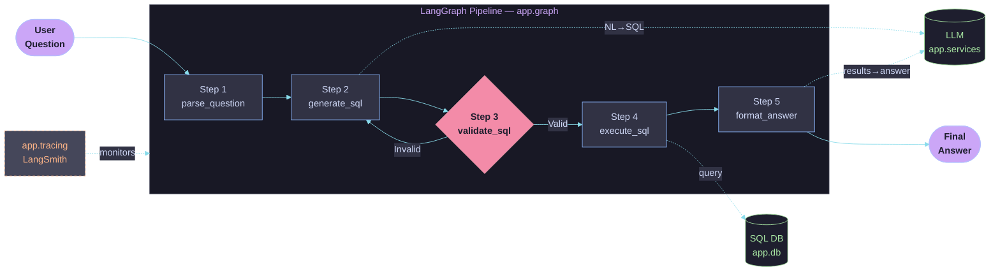

# University SQL Agent

A minimal, high-quality question-answering system using LangGraph and LangSmith to translate natural language questions into SQL queries, execute them against a database, and return a human-readable answer.

## Module Flow Diagram

The application uses LangGraph to manage state and route execution through several nodes. The following diagram shows the high-level architecture and how data flows between the modules.

### Pipeline Step Descriptions

| Step | Node | Description |
|------|------|-------------|
| 1 | `parse_question` | Parses the user's natural language question to extract intent, entities (students, courses, teachers), filters, and constraints. |
| 2 | `generate_sql` | Uses the LLM to translate the structured intent into a SQL query tailored to the university database schema. |
| 3 | `validate_sql` | Checks the generated SQL for syntax correctness and schema compatibility. If invalid, loops back to Step 2 for a retry. |
| 4 | `execute_sql` | Runs the validated SQL query against the database and retrieves the raw result set. |
| 5 | `format_answer` | Uses the LLM to convert the raw DB results into a clear, human-readable natural language answer. |
| — | `app.tracing` | LangSmith observer that traces the full execution path: User Input → Nodes → SQL → DB Results → Final Answer. |

## Project Structure

- **`app/graph.py`**: Defines the LangGraph pipeline, nodes, state dict, and routing logic.
- **`app/services.py`**: Contains LLM service wrappers and tools for generation and formatting.
- **`app/db.py`**: Handles database connections and secure query execution.
- **`app/tracing.py`**: Initializes and configures LangSmith telemetry.
- **`main.py`** (if present): Entry point to run the agent interactively.

## Getting Started

*(Add instructions on how to install dependencies and run the project here)*
